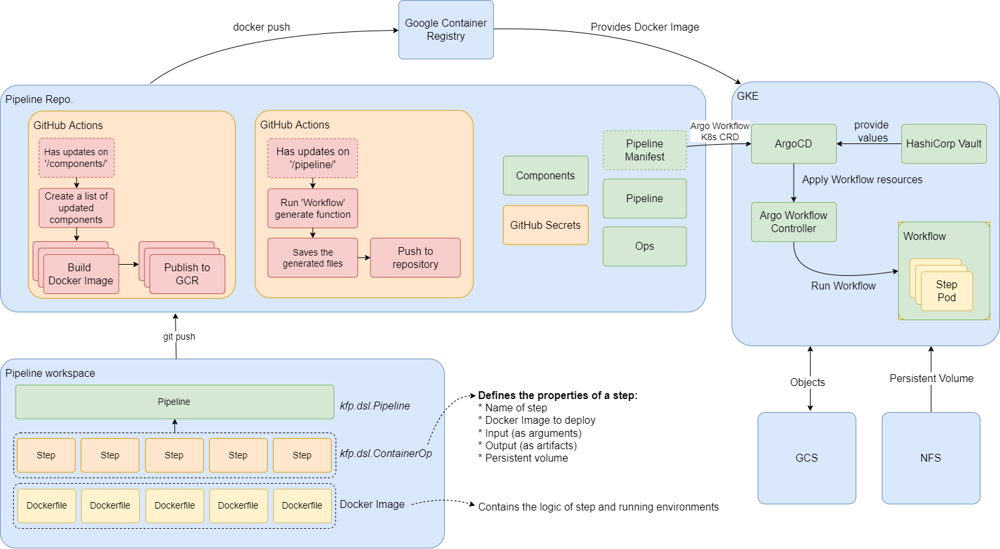

# Continuous Training Pipeline


This repository manages resources (`workflowTemplate`, `CronWorkflow`) which used in the pipeline of an Argo Workflow. CD (Continuous Deployment) could be proceed with Argocd that reads resources from resources directory and sync them to Argo Workflow.

`WorkflowTemplate` is a resource that defines pipeline and could be used to run workflow with reusability. `CronWorkflow` runs specific workflow that given at workflowTemplateRef regularly. The continuous training could be fulfilled regularly with this resources.

## Architecture


## Generate continuous training pipeline with Kubeflow Pipeline SDK

As an Argo Workflow pipeline is kubernetes resources, definition of this would be time consuming task and takes effort for pipeline management, especially for complex pipeline. However, with the introduction of KFP (Kubeflow Pipeline SDK) it would be ease the hardness of the pipeline development and management.

With the adoption of the KFP, workflow could be developed with python. It’s quite intuitive. However, As the KFP basically generates pipeline that works on a Kubeflow, some information of `metadata` from workflow should be edited to have compatibility with Argo Workflow.

## Data storage access within the module

The storage that has dataset and where the trained model saved is served with NFS protocol. Kubernetes cluster has persistent volume named `nfs-pv` that describes address and mount path information of the NFS server, and persistent volume claim that requests storage from `nfs-pv`. 

And `dsl.ContainerOp` from `kfp` has an argument `pvolumes` that set path and `dsl.PipelineVolume` with a persistent volume claim of the storage from NFS server. The module that running at the docker container would had a mounted volume, and could do read and write behavior like on the local filesystem.

### Storage structure
* **mode-checkpoint**: The path where checkpoint from training and metrics are saved
* **mdoel-deploy-config.json**: Configuration of model deployment
* **preprocess-checkpoint.json**: A list of slide filename that pre-processed
* **preprocess-metadata**: The path where pre-process metatdata which shows slide filename and related pre-processed image patches, are saved
* **region-annotation**: Annotation directory used for slide pre-processing
* **slide**: Slide directory
* **slide-patch**: The path where pre-processed data are saved or used for training and evaluation
```
.
├── model-checkpoint            - (generated automatically)
│   ├── 20210422-141741
│   ├── 20210422-144311
│   └── ...
├── model-deploy-config.json    - (generated automatically)
├── preprocess-checkpoint.json  - (generated automatically)
├── preprocess-metadata         - (generated automatically)
│   ├── 2_00223_sub0.svs.json
│   ├── 2_00225_sub0.svs.json
│   └── ...
├── region-annotation
│   ├── negative
│   │   ├── 1_00061_sub0
│   │   ├── 1_00062_sub0
│   │   └── ...
│   └── positive
│       ├── 1_00061_sub0
│       ├── 1_00062_sub0
│       └── ...
├── slide
│   ├── test
│   │   └── 2_00232_sub0.svs
│   └── train
│       ├── 2_00223_sub0.svs
│       ├── 2_00225_sub0.svs
│       ├── 2_00225_sub1.svs
│       ├── 2_00245_sub0.svs
│       └── 2_00248_sub0.svs
└── slide-patch                 - (generated automatically)
    ├── test
    │   │── ground-truth
    │   └── image
    └── train
        ├── ground-truth
        └── image
```

## Secure the value with HashiCorp Vault

With the HashiCorp Vault and argocd-vault-plugin, the private value from the resource can be secured, parsed and applied to an Argocd. 

The secured resource that had to be parsed has annotation `avp_path` that describes path where the secured value could be retrieved from the Vault. Argocd has a plugin for replacing the secured value to original value that stored on the Vault. And Argocd can acquire plain kubernetes resource that applicable. 

## Reference
* Original codes: https://github.com/zizhaozhang/nmi-wsi-diagnosis
* Pipeline with GPU: https://github.com/kubeflow/pipelines/issues/3313
* argocd-vault-plugin: https://github.com/IBM/argocd-vault-plugin
* argocd-vault-plugin configuration: https://itnext.io/argocd-secret-management-with-argocd-vault-plugin-539f104aff05
* Vault approle configuration: https://www.vaultproject.io/docs/auth/approle
* NFS service configuration: https://medium.com/scientific-breakthrough-of-the-afternoon/set-up-your-own-private-cloud-storage-with-nfs-and-google-compute-engine-c67ab9667b5b
* Artifact repostiroy configuration: https://github.com/argoproj/argo-workflows/blob/master/docs/configure-artifact-repository.md
* Configure workload identity to cluster: https://cloud.google.com/kubernetes-engine/docs/how-to/workload-identity

### Troubleshoot
* https://github.com/IBM/argocd-vault-plugin/issues/47
* https://github.com/IBM/argocd-vault-plugin/issues/103
* controller is not configured with a default... https://www.programmersought.com/article/496034877/
